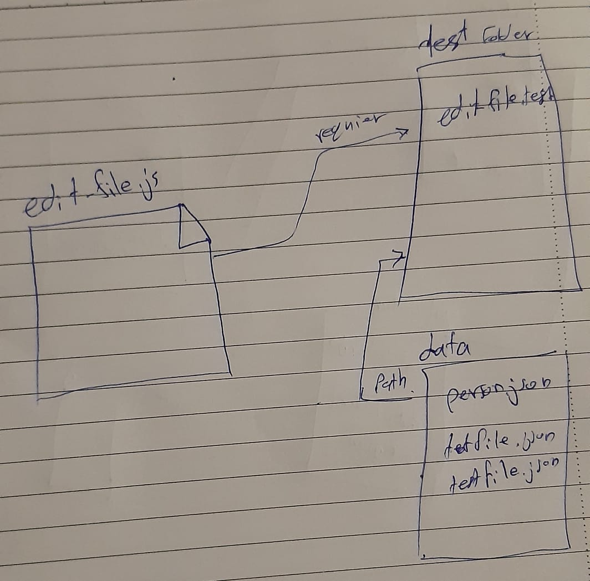

# Async

# LAB - Class 03

## Async

### Author: Ahmad Sawalqeh

### Links and Resources

- [submission PR](https://github.com/Ahmad-Sawalqeh/Async/pull/1)
- [ci/cd]() (GitHub Actions)

### Setup
run `npm i`

#### How to initialize/run your application (where applicable)
run `npm test` to check all test.

#### Tests

- How do you run tests? 
  run `npm test`

# UML

